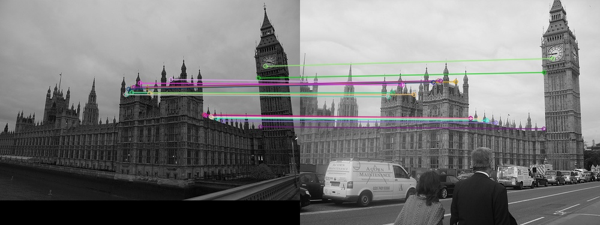
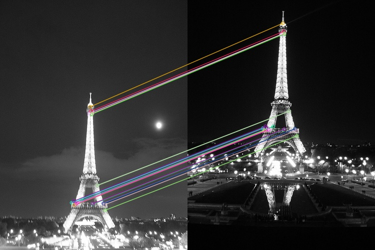

# SIFT-ImageMatching-And-Clustering

## BRAINSTORMING:

For this part I initially went through the complete details of SIFT and how it works on the images to find matching keypoints. Since I was provided with the starter code which contained the ORB code, Iwefirst thought of getting 1000 matching points for each image and to find the matching points and to provide a threshold to determine the final matching points based on the distance of the second best matching keypoint.

## IDEA 1:

First I started implementing the function called the “two_image_func()” in the code. Which takes 2 images as arguments and first it finds 1000 keypoints and descriptors for each image using ORB function. Then for each keypoint in the source image it checks the hamming distance with all the keypoints in the second using the descriptor vector of both the images. After finding the distance of all the keypoints in the second image with that particular keypoint in the source image, I sort all the kepoints with respect to distance then filter out the top two matching pairs with the least distance. Like this we do for all the keypoints in the image 1 to all the keypoint in the image 2. This provided me good matching points but even for 2 image comparison it was taking more than a minute as it has to compare 1000 keypoints in one image with the 1000 keypoints in the other image and find the hamming distance between them.

## IDEA 2:

I tried using the normal BF matcher function using ORB. That provided instant result, but I was not getting that much proper results as what I got from my previous implementation. So, I used the KNN BF matcher by using SIFT in python. This way I was able to get the top 2 matching points for a particular keypoint of an image. Then I apply a threshold of 0.8 on the ratio of the top 2 best matching points distances. Also, I apply another threshold wherein I take the best matching Euclidean distance of the descriptors to be less than 200. This way I find all possible number of matchings points of every image with every other image given through the command prompt.

Now to calculate the distance matrix, I divide the number of matching points multiplied by 2 and dividing that by 100, more the matching points then lesser this number will be. If there are no matches then we keep that particular element to be 100 And the same images will have the element in the matrix to be 0.

For example a 3 image distance matrix will look like this :

0 10 100 90 10 0 90 100 100 90 0 15 90 100 15 0

Here the diagonal elements of the distance matrix is 0 as there are lot of matching points. We could also see the that the first 2 rows are more related and last 2 rows are more related and this is how the agglomerative clustering algorithm clusters based on all the elements of the rows.

Then I pass this through the agglomerative clustering algorithm to find the best clusters. Agglomerative clustering is a hierarchical clustering where all the elements is the row are considered with all the other rows to form the clusters by taking the whole matrix as a single cluster initially.

## RESULTS:

While testing with minimal number of images with enough matching points then it forms perfect clustering with better accuracy. But while testing the 93 test images, there are various matching points across different images and so the accuracy is a bit less.

In our case while testing with the 93 image with 10 clusters the pairwise accuracy that we got was:

The True Positive (TN) 160 The True Negative (TP) : 6804 No. of image (N) : 93

Now the calculated pairwise accuracy is : (TP + TN)/(N*(N-1))

The accuracy that we got for this 93 images is : 0.81393

Though the SIFT algorithm gives good matching points there are various other places where it provides matching points for different images having same set of descriptor values for a particular corner and edges. As we know Deep learning can be used to solve this type of issues now.
